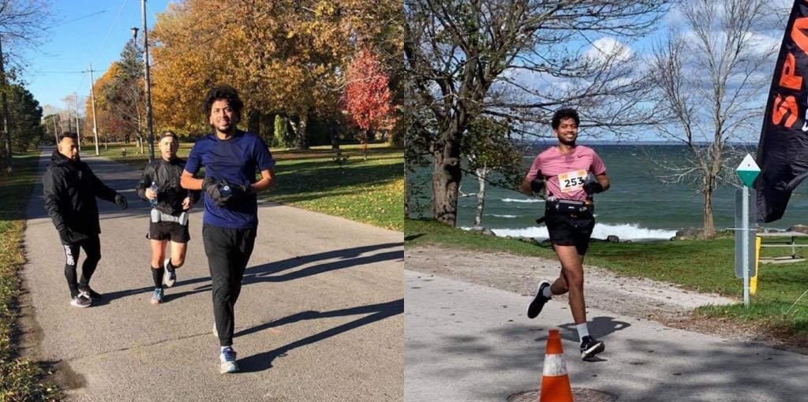
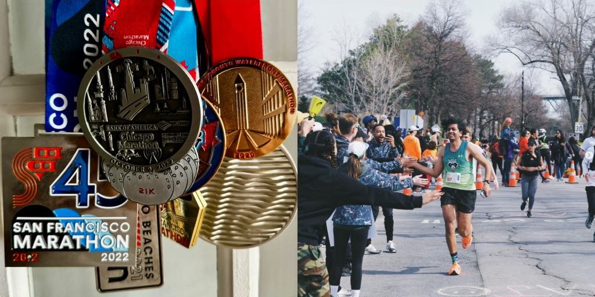

  

    <strong class="news-badge">
      ★ NEWS
    </strong>
  

  <ul class="news-list">
    <li><strong>Feb 2026</strong> – Signed up for my first 50 km ultra-marathon at the <a href="https://www.niagaraultra.ca/">Niagara Ultra</a> in June 2026! 🎉</li>
  </ul>

Since the COVID-19 pandemic, I've been into long-distance running! It's had the greatest influence on my mental health and social life. My first race was the 2020 Lululemon Half-marathon in Toronto which I completed in 2:00:33 hrs. Here are all the races in reverse chronological order I've run since! :-)  

2025 - [Montreal Beneva Marathon 42.2k](https://couronsmtl.com/en/marathon-beneva/home/) (5:23:24)  
2023 - [21k de Mtl Half-marathon](https://mtlmarathon.com/en/) (1:56:10)  
2022 - [Chicago Marathon](https://www.chicagomarathon.com/) (3:58:45)  
2022 - [The San Francisco Marathon](https://www.thesfmarathon.com/) (4:16:04)  
2022 - [Around the Bay 30k Hamilton](https://bayrace.com/) (3:16:17)  
2021 - [Georgina Marathon](https://enduranceeventproductions.com/events/georgina-marathon-and-half-marathon/) (3:56:49)  
2021 - [Toronto Beaches Half-marathon](https://raceroster.com/events/2021/47548/beaches-jazz-run-2021) (2:07:39)  
2020 - [Scotiabank Toronto Virtual Marathon](https://www.torontowaterfrontmarathon.com/) (4:21:56)  
2020 - [Lululemon Toronto Virtual Half-marathon](https://shop.lululemon.com/en-ca/story/10k-run) (2:00:33)  

My best 42.2 km marathon finish time to date is 3:56:49 hrs.  
I am planning to run my first (and likely the last!) 50 km ultra-marathon soon sometime in 2026! 

If you are a fellow runner or if you'd like to follow my training, add me on Strava!  
<a style="display:inline-block;background-color:#FC5200;color:#fff;padding:5px 10px 5px 30px;font-size:11px;font-family:Helvetica, Arial, sans-serif;white-space:nowrap;text-decoration:none;background-repeat:no-repeat;background-position:10px center;border-radius:3px;background-image:url('https://badges.strava.com/logo-strava-echelon.png')" href='https://strava.com/athletes/51884474' target="_clean">
  Follow me on
  
</a>

<iframe height='454' width='300' frameborder='0' allowtransparency='true' scrolling='no' src='https://www.strava.com/athletes/51884474/latest-rides/4aa40654fbab443f7e453cb1a02334471cf8e2a1'></iframe>

